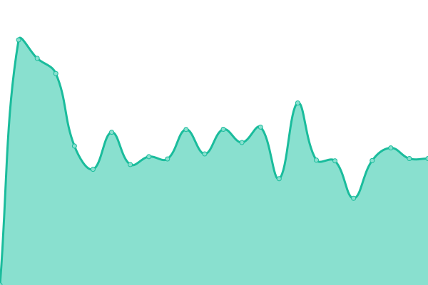
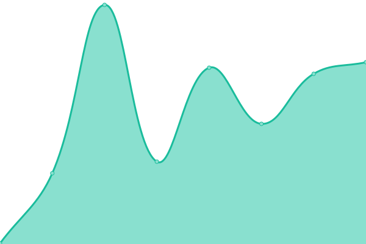
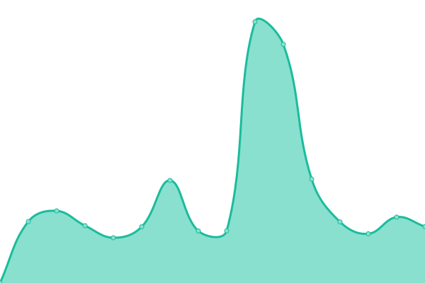
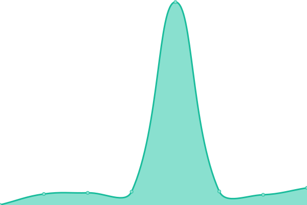
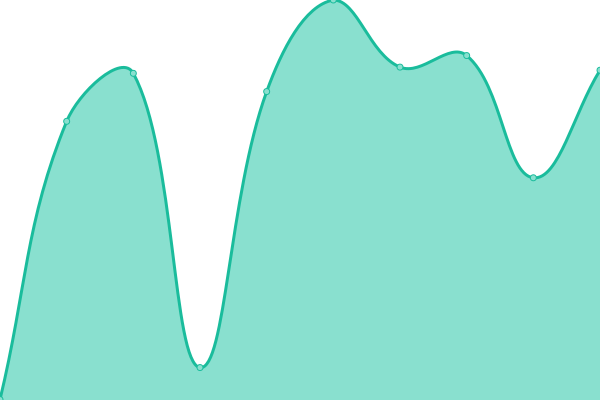
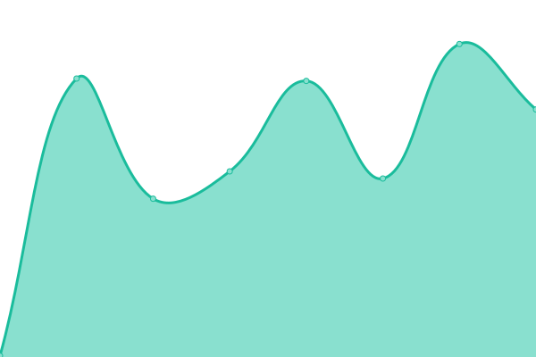
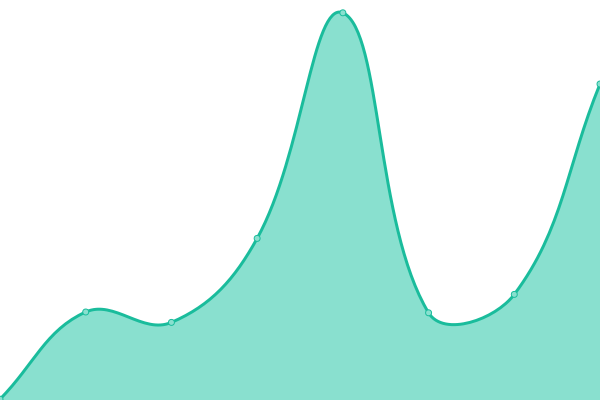

# [📈 Live Status](https://CT-crew.github.io/mw-monitoring): <!--live status--> **🟩 All systems operational**

This repository contains the open-source uptime monitor and status page for [CT-crew](https://CT-crew.github.io/mw-monitoring), powered by [Upptime](https://github.com/upptime/upptime).

With [Upptime](https://upptime.js.org), you can get your own unlimited and free uptime monitor and status page, powered entirely by a GitHub repository. We use [Issues](https://github.com/CT-crew/mw-monitoring/issues) as incident reports, [Actions](https://github.com/CT-crew/mw-monitoring/actions) as uptime monitors, and [Pages](https://CT-crew.github.io/mw-monitoring) for the status page.

<!--start: status pages-->
<!-- This summary is generated by Upptime (https://github.com/upptime/upptime) -->
<!-- Do not edit this manually, your changes will be overwritten -->
<!-- prettier-ignore -->
| URL | Status | History | Response Time | Uptime |
| --- | ------ | ------- | ------------- | ------ |
|  [MW-HomePage](https://millennialsworks.com) | 🟩 Up | [mw-home-page.yml](https://github.com/CT-crew/mw-monitoring/commits/HEAD/history/mw-home-page.yml) | 

 1624ms
     
 | 

<a href="https://CT-crew.github.io/mw-monitoring/history/mw-home-page">94.39%</a>
    

|  [Ammw landing page](https://info.ammw.net) | 🟩 Up | [ammw-landing-page.yml](https://github.com/CT-crew/mw-monitoring/commits/HEAD/history/ammw-landing-page.yml) | 

 431ms
     
 | 

<a href="https://CT-crew.github.io/mw-monitoring/history/ammw-landing-page">100.00%</a>
    

|  [SpaceV landing page](https://spacev.info) | 🟩 Up | [space-v-landing-page.yml](https://github.com/CT-crew/mw-monitoring/commits/HEAD/history/space-v-landing-page.yml) | 

 502ms
     
 | 

<a href="https://CT-crew.github.io/mw-monitoring/history/space-v-landing-page">100.00%</a>
    

|  Mw-Admin | 🟩 Up | [mw-admin.yml](https://github.com/CT-crew/mw-monitoring/commits/HEAD/history/mw-admin.yml) | 

 1401ms
     
 | 

<a href="https://CT-crew.github.io/mw-monitoring/history/mw-admin">98.96%</a>
    

|  MW-Server | 🟩 Up | [mw-server.yml](https://github.com/CT-crew/mw-monitoring/commits/HEAD/history/mw-server.yml) | 

 734ms
     
 | 

<a href="https://CT-crew.github.io/mw-monitoring/history/mw-server">87.92%</a>
    

|  MUSIC | 🟩 Up | [music.yml](https://github.com/CT-crew/mw-monitoring/commits/HEAD/history/music.yml) | 

 351ms
     
 | 

<a href="https://CT-crew.github.io/mw-monitoring/history/music">100.00%</a>
    

|  [Google](https://www.google.com) | 🟩 Up | [google.yml](https://github.com/CT-crew/mw-monitoring/commits/HEAD/history/google.yml) | 

 108ms
     
 | 

<a href="https://CT-crew.github.io/mw-monitoring/history/google">100.00%</a>
    

|  [Cloudflare](https://www.cloudflare.com/ko-kr) | 🟩 Up | [cloudflare.yml](https://github.com/CT-crew/mw-monitoring/commits/HEAD/history/cloudflare.yml) | 

 690ms
     
 | 

<a href="https://CT-crew.github.io/mw-monitoring/history/cloudflare">100.00%</a>
    

|  [Docker](https://www.docker.com) | 🟩 Up | [docker.yml](https://github.com/CT-crew/mw-monitoring/commits/HEAD/history/docker.yml) | 

 298ms
     
 | 

<a href="https://CT-crew.github.io/mw-monitoring/history/docker">100.00%</a>
    

|  [Figma](https://www.figma.com) | 🟩 Up | [figma.yml](https://github.com/CT-crew/mw-monitoring/commits/HEAD/history/figma.yml) | 

 106ms
     
 | 

<a href="https://CT-crew.github.io/mw-monitoring/history/figma">100.00%</a>
    

<!--end: status pages-->

[**Visit our status website →**](https://CT-crew.github.io/mw-monitoring)

## 📄 License

- Powered by: [Upptime](https://github.com/upptime/upptime)
- Code: [MIT](./LICENSE) © [Anand Chowdhary](https://anandchowdhary.com), supported by [Pabio](https://pabio.com)
- Data in the `./history` directory: [Open Database License](https://opendatacommons.org/licenses/odbl/1-0/)
